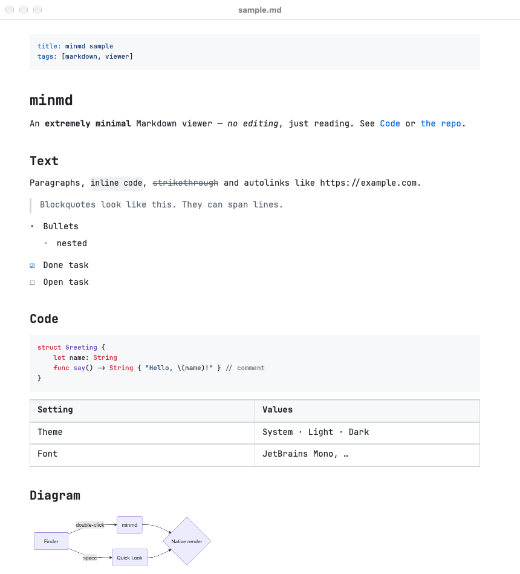
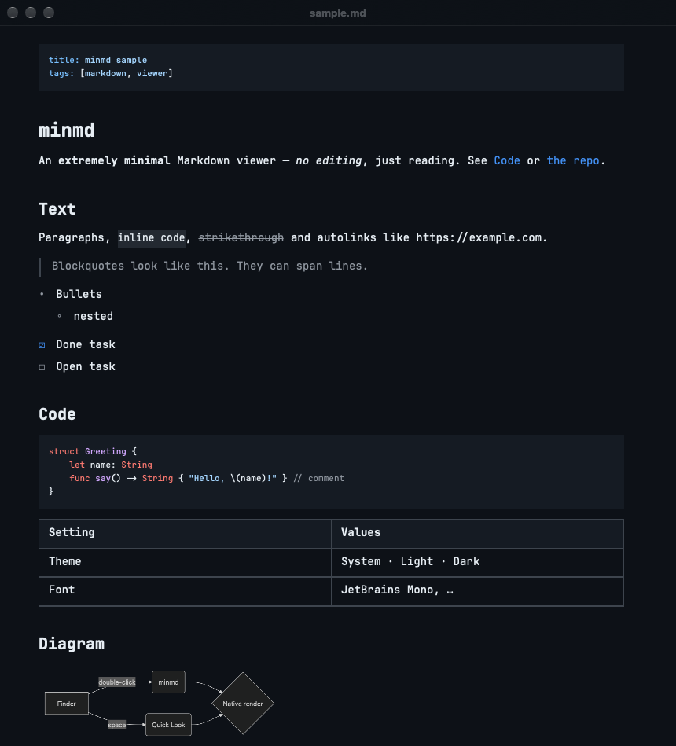

# minmd

An extremely minimal, fast Markdown **viewer** for macOS. No editor, no sidebar, no tabs — one file per window, rendered natively in [JetBrains Mono](https://www.jetbrains.com/lp/mono/) with GitHub's light and dark colors, and the same rendering when you press <kbd>Space</kbd> in Finder.

<p>
  
  
</p>

## Features

- **Viewer only.** minmd never writes to your files.
- **One file, one window.** Opening another Markdown file opens another window.
- **Native and fast.** AppKit text rendering — no web view for the document itself.
- **Quick Look.** Select a `.md` file in Finder and press <kbd>Space</kbd>.
- **Live reload.** Edit the file in any editor; the window updates in place and keeps its scroll position.
- **GitHub-flavoured Markdown.** Tables, task lists, strikethrough, autolinks, front matter, images, syntax-highlighted code and [Mermaid](https://mermaid.js.org) diagrams.
- **Two settings** (<kbd>⌘,</kbd>): theme (System / Light / Dark) and font. Quick Look uses the same settings.
- <kbd>⌘F</kbd> find, <kbd>⌘+</kbd> / <kbd>⌘-</kbd> / <kbd>⌘0</kbd> zoom, <kbd>⇧⌘R</kbd> show in Finder. Links open in your browser; links to other Markdown files open in minmd.

## Performance

Time from `open file.md` to the first painted frame, median of 10 runs on an M-series Mac:

| | minmd | bare AppKit app (floor) |
|---|---|---|
| App not running (launch) | ~275 ms | ~220 ms |
| App already running (new window) | ~90 ms | — |
| 200 KB / 5,600-line document, launch | ~350 ms | — |

How it stays quick:

- Markdown is parsed by cmark-gfm (via swift-markdown) straight into an attributed string — a typical README takes ~4 ms.
- The text system and fonts warm up on a background thread while AppKit is still launching.
- Syntax highlighting (highlight.js in JavaScriptCore) runs off the main thread and colors code blocks right after the first frame.
- Mermaid diagrams need a browser engine, so a hidden WebKit view is started only for documents that contain one, after the first frame.
- Images are sized from their headers up front and decoded on a background thread; layout is non-contiguous.

minmd stays running after its last window closes, so later files open in ~90 ms.

To measure yourself: `open --env MINMD_TRACE=/tmp/minmd.log -a minmd file.md` writes launch milestones (ms since process start) to that file.

## Install

Requires macOS 14+, Xcode, and [XcodeGen](https://github.com/yonaskolb/XcodeGen) (`brew install xcodegen`).

```sh
git clone https://github.com/janostik/minmd.git
cd minmd
make install        # builds Release and copies minmd.app to /Applications
```

Then:

1. **Make it the default viewer:** in Finder, select any `.md` file → <kbd>⌘I</kbd> → *Open with* → **minmd** → **Change All…**
2. **Quick Look:** it registers automatically on install. If <kbd>Space</kbd> still shows plain text, enable *minmd Quick Look* in **System Settings → General → Login Items & Extensions → Quick Look**, then run `qlmanage -r`.

The build is ad-hoc signed (no Apple Developer account needed), so it is meant to be built locally.

## Development

```sh
make open    # generate minmd.xcodeproj and open it in Xcode
make build   # command-line Release build into ./build
```

The Xcode project is generated from `project.yml` and is not checked in.

```
App/          AppKit app: read-only NSDocument, window, menus, settings, file watcher
QuickLook/    Quick Look preview extension
Shared/       Renderer, viewer, highlighter, Mermaid renderer; fonts and vendored JS
```

## License

MIT. Bundled third-party components are listed in [THIRD_PARTY_NOTICES.md](THIRD_PARTY_NOTICES.md).
