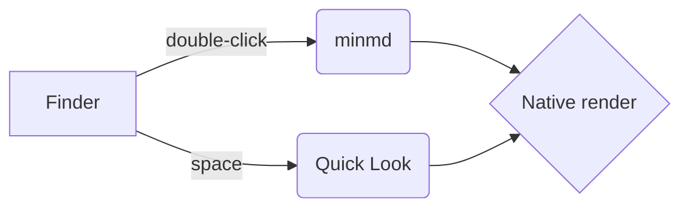

# minmd

An **extremely minimal** Markdown viewer — *no editing*, just reading. See [Code](#code) or [the repo](https://github.com/janostik/minmd).

## Text

Paragraphs, `inline code`, ~~strikethrough~~ and autolinks like https://example.com.

> Blockquotes look like this.
> They can span lines.

- Bullets
  - nested
- [x] Done task
- [ ] Open task

## Code

```swift
struct Greeting {
    let name: String
    func say() -> String { "Hello, \(name)!" } // comment
}
```

| Setting | Values                |
|---------|-----------------------|
| Theme   | System · Light · Dark |
| Font    | JetBrains Mono, …     |

## Diagram


